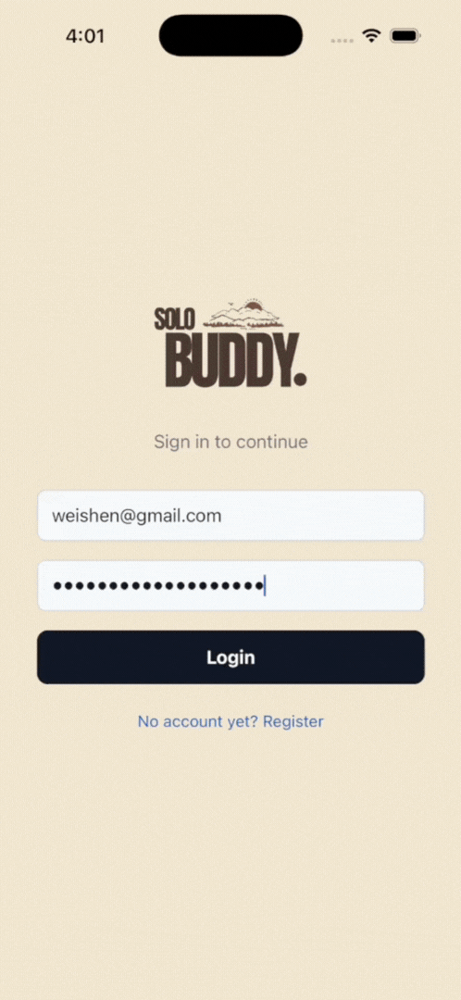
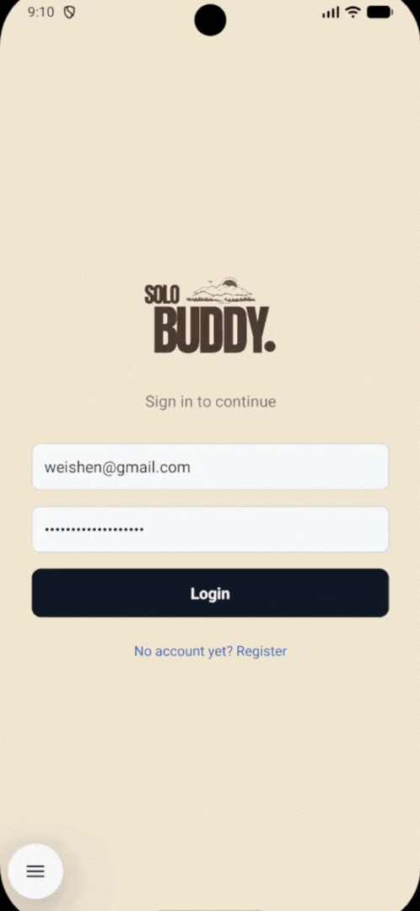

# SoloBuddy, your Travel Safety Companion

<p align="center">
  
  
  
</p>
<p align="center">
  <em>iOS Preview</em> &nbsp;·&nbsp; <em>Android Preview</em> &nbsp;·&nbsp; <em>Explore</em>
</p>

SoloBuddy is a travel companion app built for solo travellers. It combines destination exploration (nearby attractions, maps, search), suggested itinerary creation, a community feed and a dedicated Safety tab surfacing official travel advisories, local news and real time local weather. Save places to your trip wishlist, track what you have visited, and head somewhere new with confidence.

## Try the App (Android)

Download the latest Android APK from our GitHub releases page:

📱 [Download latest APK (Android)](https://github.com/WeiShenL/solobuddy/releases/latest)

> **Note:** Tested on Google Pixel 7 Pro, Samsung Galaxy S20.

## Prerequisites

- [Node.js](https://nodejs.org/) v18+
- [Expo Go](https://expo.dev/go) on your phone
- [Android Studio](https://developer.android.com/studio) (for Android emulator)
- [Xcode](https://developer.apple.com/xcode/) (for iOS simulator)

## Quick Start

1. **Clone the repository**

   ```bash
   git clone https://github.com/WeiShenL/solobuddy
   cd solobuddy
   ```

2. **Install dependencies**

   ```bash
   npm install
   ```

3. **Start the dev server**

   ```bash
   npm run dev
   ```

Once running, press `?` to see all options, then:

| Key | Action |
|-----|--------|
| `s` | Switch to Expo Go / Development Build |
| `w` | Open in web browser |
| `a` | Open in Android emulator |
| `i` | Open in iOS simulator (macOS only) |

First, press `s` to ensure the dev server is using **Expo Go**. Then:

- **Android:** Open Android Studio and launch your preferred device emulator from the Device Manager, then press `a` in the terminal. (Tested with Pixel 10 Pro in Studio) 
- **iOS:** Press `i` in the terminal to open the iOS simulator. (Mac only) 
- **Physical phone:** Open the **Expo Go** app and scan the QR code shown in the terminal (iOS: use the Camera app; Android: use the "Scan QR code" option inside Expo Go).

> **Note:** If the terminal prompts `It is recommended to log in with your Expo account before proceeding`, just select **Proceed anonymously**.

---

## 🌐 Web Development & Deployment

> 💡 **Note on Web Version:** The web version of SoloBuddy is provided as a web simulation of the mobile app for easy browser preview and interactive demonstration without needing a physical device or emulator. For the authentic native and bug-free mobile experience with native gestures and maps, download the Android APK in the release page or run via Expo Go on iOS/Android.

### Local Web Development
```bash
# Start Web directly in Expo Go mode (http://localhost:8081)
npm run web
```

### Local Production Web Testing
```bash
# 1. Export static production web bundle to dist/
npx expo export --platform web

# 2. Serve static bundle locally (http://localhost:3000)
npm run serve:web

# 3. Test Production Caddy container in Docker (http://localhost:8080)
docker compose up -d
```

### Production VPS Deployment (Co-hosting with Root Caddy)
```bash
docker compose -f docker-compose.yml -f docker-compose.prod.yml up -d
```

### Production Deployment & CI/CD
- **CI Workflow ([.github/workflows/ci.yml](file:///Users/weishen/NonSchool/Github/solobuddy/.github/workflows/ci.yml))**: Runs `npm run lint`, `npx expo config`, and `npx expo export --platform web` in 3 parallel jobs on PRs.
- **Release Workflow ([.github/workflows/release.yml](file:///Users/weishen/NonSchool/Github/solobuddy/.github/workflows/release.yml))**: Builds Caddy Web Docker image for **Watchtower** auto-deploy and compiles Android `.apk` on Expo EAS cloud.
---

## Tech Stack

- [React Native](https://reactnative.dev/) + [Expo SDK 54](https://expo.dev/)
- [Expo Router](https://expo.github.io/router/) — file-based navigation
- [MobX](https://mobx.js.org/) — reactive state management
- [react-native-maps](https://github.com/react-native-maps/react-native-maps) — native map rendering on iOS & Android (IOS: Apple Maps, Android: Google Maps)

## External APIs

| API | Purpose |
|-----|---------|
| [Google Places API (New)](https://developers.google.com/maps/documentation/places/web-service) | Nearby attractions, text search, place details |
| [Google Weather API](https://developers.google.com/maps/documentation/weather) | Current conditions, 7-day forecast, UV index |
| [Google Air Quality API](https://developers.google.com/maps/documentation/air-quality) | Real-time Air Quality Index (AQI) |
| [UK Foreign Travel Advisory](https://www.gov.uk/foreign-travel-advice) | Official UK government travel safety alerts |
| [US State Dept. Travel Advisory](https://travel.state.gov/) | US travel safety level (1–4) by country |
| [NewsAPI](https://newsapi.org/) | Recent news articles for the destination |
| [OpenRouter](https://openrouter.ai/) | AI-generated day-by-day travel itinerary |
| [Firebase Auth](https://firebase.google.com/docs/auth) | User authentication |
| [Firebase Firestore](https://firebase.google.com/docs/firestore) | User profiles, wishlist, community posts (real-time) |
| [Firebase Storage](https://firebase.google.com/docs/storage) | Profile photo upload and hosting |
| [Google Cloud Run / Functions](https://cloud.google.com/run) | Serverless backend execution for travel advisory caching |
| [Google Cloud Scheduler](https://cloud.google.com/scheduler) | Monthly cron job trigger for advisory cache refreshes |